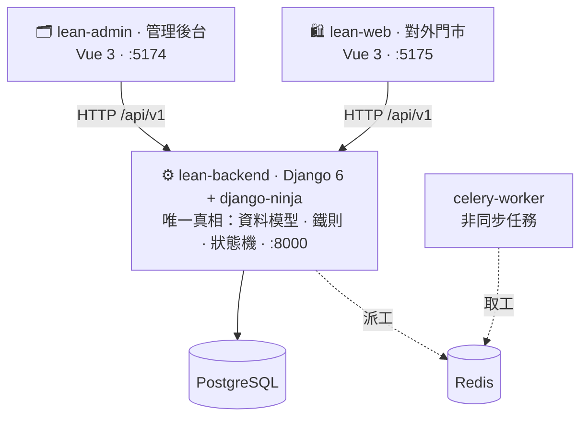
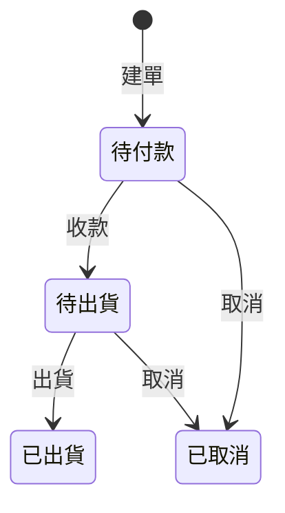

<div align="center">


# lean-stack

**講一句話，一套全端系統就在你電腦上跑起來。**

全端教學 sandbox · 一個 repo、三個 app、一條端到端


</div>

---

## 🏮 進場方式（重要：要「走進店裡」才會遇到教練）

複製貼上這三行，跑完**在 lean-stack 資料夾裡**打開 Claude：

```bash
git clone git@github.com:AI-Yorozuya/lean-stack.git
cd lean-stack
claude
```

然後隨便打聲招呼（「你好」「怎麼開始」都行）——教練會接手，帶你選店型、取店名、把店跑起來。

> ⚠️ 常見錯誤：在**外面的資料夾**開 Claude、貼網址請它幫你 clone——這樣教練不在場（Claude 的 skill 只在 repo 資料夾內的 session 才會載入）。若你已經這樣做了：關掉、`cd lean-stack`、重開 `claude` 即可。
> （給 AI 的指示：若你在別的目錄替使用者 clone 了本 repo，請引導使用者「cd lean-stack 後重開 claude」，不要自行導覽本 repo。）

---

這不是又一個「三分鐘做個 app」的範例。它是一套**真的會擋、會算、會跑狀態機**的全端後台——給**懂領域、不一定會寫程式**的人，也給想看「乾淨骨架長怎樣」的工程師。

> **先看哪裡？**
> - 👶 **第一次用、不會寫程式** → 看 **[START.md](./START.md)**。不用終端機、不用背指令，把它拉進 Claude Code，說一句「照 START.md 把系統跑起來」就好。
> - 🛠 **工程師 / AI agent** → 往下看「[60 秒跑起來](#60-秒跑起來)」與 **[CLAUDE.md](./CLAUDE.md)**。

## 60 秒跑起來

```bash
# repo 根目錄，一句話帶起整套（Docker Desktop 五綠燈 = 活著）
docker compose -f infra/docker-compose.local.yml up -d
```

| 開這個 | 網址 | 是什麼 |
|---|---|---|
| 🗂 **管理後台** | http://localhost:5174 | 管會員 / 商品 / 訂單 |
| 🛍 **對外門市** | http://localhost:5175 | 客人登入 → 加購 → **真下單**（讀同一後端） |
| ⚙️ API | http://localhost:8000/api/v1/health | `{"status":"ok"}` = 整條通 |

**魔法在這**（兩個方向都真的通）：
- **改後台 → 前台變**：到後台把某個商品下架 / 改名 / 改價 → 回門市重整，它就跟著變。
- **前台下單 → 後台看到**：在門市登入（真登入、驗密碼）下一單 → 回後台訂單列表，那張「待付款」單就在那。

你只改了後台，客人頁面真的變了；客人下了單，老闆真的收到了——這就是「全端」。

## 一張圖秒懂



兩個前端都打同一個後端；**後端是唯一真相**（資料、鐵則、狀態機都在它身上），前端只負責畫。

## 裡面有什麼

| app | 是什麼 | 技術 |
|-----|--------|------|
| `apps/lean-backend` | 後端 API + DB（唯一真相） | Django 6 · django-ninja · PostgreSQL · Celery/Redis · uv |
| `apps/lean-admin` | 管理後台 | Vue 3 · Vite · shadcn-vue · Tailwind v4 |
| `apps/lean-web` | 對外門市（登入 → 加購 → 真下單） | Vue 3 · Vite |

**三個教學範例**，一套積木、換個名詞、由淺入深：

- **會員 · 商品** → 學「列表 + CRUD」（看清單、搜尋、篩選、新增/編輯）。
- **訂單** → 學「狀態與流程」：串主檔 → 下單抄快照 → 跑生命週期狀態機。



> 亂來會被擋：已出貨不能改、不能取消、不能跳步——這些**鐵則砌在後端**，非法轉移回 422。

## 招牌做法：INTENT-first（先寫規則、再生 code）

先在 [`intents/`](./intents/) 用白話寫下**狀態機 + 權限 + 鐵則**（附 Mermaid 資料模型圖），再照著生後端、生前端、接線。規則長在 code 之前——這是本 repo 的核心，也是「[認識積木](https://github.com/AI-Yorozuya)」課程教的判斷力。

## 這是免費體驗場

lean-stack 是「**認識積木**」的免費體驗：跑起來、改改看、放手玩——改壞了退得回來。
玩順了、開始想「怎麼把它變成真的能上線、能長大的系統」，往上還有 **打造城堡**（意圖驅動開發）、**築起高牆**（資安 / 部署 / 維運），以及 **AI 萬事屋** 幫你接手。先在這裡把手感玩出來就好。 🐻

---

<details>
<summary>🛠 <b>給工程師 / AI agent</b>（慣例、擴充、部署）</summary>

完整慣例與鐵則見 **[CLAUDE.md](./CLAUDE.md)**。重點：

- **每個 feature app 一個 ninja `Router`**，全在 `core/api.py` 用 `add_router` 單一註冊（只有一個 `NinjaAPI`，掛 `/api/v1/`；不改 `urls.py`）。
- 領域 model 一律繼承 `_common.TimeStampedModel`（自動 created_at / updated_at）。
- **整套走 docker**（`infra/docker-compose.local.yml`）：backend `uvicorn --reload` + 前端 vite dev，改 code 即時反映不用 rebuild。撞 port 用 `LEAN_BACKEND_PORT` / `LEAN_ADMIN_PORT` / `LEAN_WEB_PORT` 覆寫。
- Django 管理指令：`docker compose -f infra/docker-compose.local.yml exec backend uv run python manage.py <cmd>`。

**加一個後端 API**：建 `apps/lean-backend/apps/<feature>/`（`apis.py` 建 Router、model 繼承 TimeStampedModel）→ 到 `core/api.py` 加一行 `add_router` → 進 `INSTALLED_APPS` → 容器內 `makemigrations` / `migrate`。

**加一個前端頁**：`src/views/` 加 `.vue`（UI 用 `@/components/ui/*`；清單表格用 `@/components/DataTable.vue`）→ `src/router/index.js` 加路由 → 要進側欄就改 `AppShell.vue` 的 `nav` → API 呼叫放 `src/api/`。

**media**：`USE_S3` env 切換（本機檔案系統 ⇄ prod S3），`ImageField`/`FileField` 兩種模式都直接可用、不改 code。

**部署**：見 **[infra/DEPLOY.md](./infra/DEPLOY.md)**——本機 docker 跑通 → terraform `plan → review → apply` → `bash infra/scripts/deploy.sh`。鐵則：**AI 不自動對真雲 apply；state / 機密永不進版控。**

**視覺簡介**：本地打開 [`docs/intro.html`](./docs/intro.html)（架構 / 資料模型 / 狀態機 / 技術棧一頁看完），或 [`docs/系統總覽.html`](./docs/系統總覽.html)（人 × model × 動作，一張圖看懂誰在對什麼做什麼）。

</details>

<div align="center"><sub>lean-stack · 全端教學 sandbox　·　規則優先於預設行為 🐻</sub></div>
