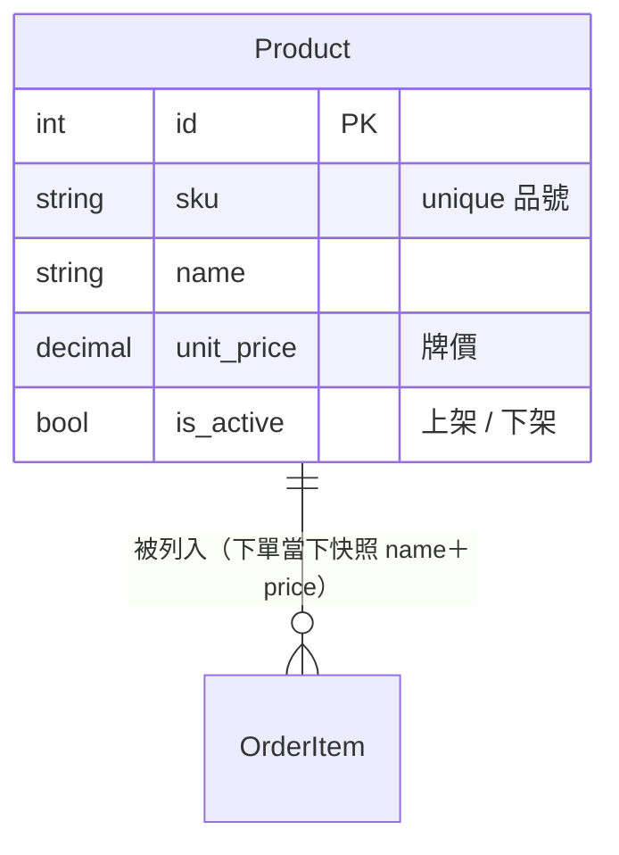

# INTENT: 商品管理

> 管可販售的商品／服務**目錄**。跟 [會員管理](會員管理.md) 一樣講「**列表＋CRUD**」＋一個**獨立狀態（開關）**：上架／下架，隨時可翻。（跟 [訂單](訂單管理.md) 的「生命週期狀態」對照著看。後端 app 名：`product`）

## 名詞（這個功能裡的「東西」）

- `商品 Product`：一個可賣的品項或服務（品號、品名、牌價、上下架狀態）。**它是價格與品名的單一真相**——[訂單管理](訂單管理.md) 的明細在下單當下從這裡「抄一份快照」，之後改這裡不動歷史訂單。

> **資料模型圖**（純文字，可直接改）：



> model 設計原則（快照 / 衍生 / 業務識別碼 / 停用不刪）→ 見 [資料模型設計原則](資料模型設計原則.md)。

## 角色（Who）

- `管理員 Admin`：新增 / 查 / 改 / 下架商品。（sandbox 先不做多人分權）

## 狀態（獨立狀態／開關）

狀態：`上架`、`下架`——**獨立狀態**：兩態、可逆、隨時翻、無守衛、無終點。跟會員的啟用/停用同一個形狀（開關）。

```
(無)  --(管理員: 新增)-----> 上架   [sku 未被用過]   {一 sku 一商品}
上架  --(管理員: 下架)-----> 下架                    {下架只是停售，不刪資料}
下架  --(管理員: 重新上架)-> 上架
```

> **獨立狀態 vs 生命週期狀態**：上架/下架只回答「現在賣不賣？」（屬性，隨你翻）；[訂單](訂單管理.md) 的狀態回答「走到哪一步、下一步能去哪？」（歷程，有向、有守衛、有終態）。會員／商品是狀態光譜最小的那端，訂單是完整的那端。

## 權限 5W（每個 Action 一組）

| Action | Who | What（資源/欄位） | When（狀態/條件） | Where（範圍） | Why（理由） |
|--------|-----|------------------|------------------|--------------|------------|
| 新增 | 管理員 | 商品（全欄） | sku 未重複 | 平台 | 建目錄 |
| 改 | 管理員 | 商品（除 sku） | 上架/下架皆可 | 平台 | 維護品名／牌價 |
| 下架 | 管理員 | 商品.狀態 | 上架時 | 平台 | 停售、保留歷史 |
| 重新上架 | 管理員 | 商品.狀態 | 下架時 | 平台 | 重新開賣 |

## 鐵則（永遠成立，不可破）

- {一個 sku 只能對到一個商品}
- {下架 = 停售，資料保留（不是 DELETE）；歷史訂單明細仍指得到}
- {改牌價只影響「之後的新訂單」，不動已成立訂單的明細快照}

## 邊界 / 暫不處理（park）

- 庫存 / 數量管理——深水，park（見訂單 INTENT 也 park 了扣庫存）。
- 商品分類 / 標籤、商品圖片——UIUX 按需，park（圖片：media 機制已有，之後接）。
- 多價 / 促銷 / 折扣 / 時段價——park。
