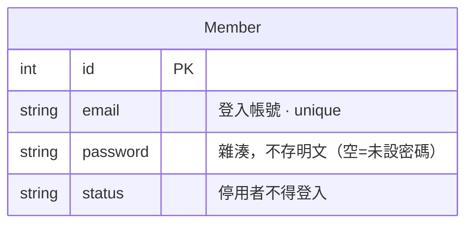

# INTENT: 會員登入

> 讓 [會員](會員管理.md) 用「email + 密碼」證明自己是本人，換一張**憑證（token）**；之後帶著憑證的請求，後端才認得「你是誰」。本 repo 用它講 auth 的**最小骨架**：雜湊密碼 → 發憑證 → 守衛驗證。（後端 app：沿用 `member`；門市前台：`lean-web`）

## 名詞（這個功能裡的「東西」）

- `密碼 password`：會員設定的登入密碼。**永遠存雜湊、不存明文**（Django `make_password`／PBKDF2）。空 = 還沒設密碼、不能登入。
- `憑證 token`：登入成功後後端發的一張「通行證」。內含 `member_id`、有簽章（偽造不了）、有有效期（過期自動失效）。前端把它帶在 `Authorization: Bearer <token>`。

> **資料模型圖**：只在 [會員](會員管理.md) 上多一個 `password` 欄，不新增表。



## 角色（Who）

- `會員 Member`：門市前台的客人。輸入自己的 email + 密碼登入。
- `守衛 Auth`：非人。掛在「要登入才能用」的端點前，驗憑證、把 `Member` 放進 `request.auth`。

## 狀態機

登入不是資料的生命週期，而是**一次請求的驗證流程**。用同一套語法描述「一張請求」怎麼走：

狀態：`未登入`、`已登入（持有效憑證）`、`憑證失效`

```
未登入        --(會員: POST /member/login)--> 已登入   [email 對到啟用中會員 且 密碼雜湊比對通過]  {帳密錯不透露是哪個錯，一律 401}
已登入        --(會員: 帶憑證打受保護端點)--> 已登入   [簽章正確 且 未過期 且 會員仍啟用]           {驗不過一律 401}
已登入        --(時間: 超過有效期)---------> 憑證失效                                            {逾期自動失效，需重新登入}
已登入        --(會員: 登出)---------------> 未登入                                              {前端丟掉憑證即可，後端無狀態}
```

## 權限 5W（每個 Action 一組）

| Action | Who | What（資源/欄位） | When（狀態/條件） | Where（範圍） | Why（理由） |
|--------|-----|------------------|------------------|--------------|------------|
| 登入 | 會員 | email + 密碼 → 憑證 | 會員啟用中、密碼正確 | 門市 | 證明本人、換通行證 |
| 取本人資料 | 會員 | 自己的 Member | 持有效憑證 | 自己 | 示範「憑證鎖得住端點」 |
| 登出 | 會員 | 前端持有的憑證 | 已登入 | 自己 | 丟掉通行證 |

## 鐵則（永遠成立，不可破）

- {密碼永遠存雜湊，絕不存／回傳明文}
- {憑證有簽章 + 有效期——偽造不了、逾期自動失效}
- {帳號或密碼錯 → 一律回同一句 401，不透露是帳號還是密碼錯}
- {停用中的會員不得登入、憑證也不再認}

## 設計選擇（教學版 vs 生產）

- **憑證用 Django 內建 `django.core.signing`，不用 JWT。** 同一套概念（簽章 + 有效期 + 帶在 header），但少一個依賴——`pyproject` 本就刻意砍掉 pyjwt。
- 生產級（access + refresh、audience、演算法選擇…）見下游 `top-erp` 的 `MemberJWTHelper`。要升級只換 `apps/member/auth.py` 的發／驗兩個函式，端點與前端不動。

## 已落地：門市下單強制登入（BFF）

「登入才能下單」用**獨立一個 `web` app（門市 BFF）**做，不動共用的 `/order`：

- 後台店員替客人建單 → `POST /order`（收 `member_id`，指定替誰下）。
- 門市客人自己下單   → `POST /web/order`（`auth=member_auth`，**不收 member_id**，下單的人 = `request.auth`）。

同一個「下單」動作、兩種角色，用**兩支端點**分開，比在一支上做 optional-auth 乾淨；
建單鐵則不重寫，共用 order 的 `place_order`（一處真相）。見 `apps/web/apis.py`。

## 邊界 / 暫不處理（park）

- **自助註冊 / 忘記密碼 / OTP / LINE 綁定**——生產有（見 top-erp），教學 park。這裡只有「登入」。
- **refresh token**——教學版只發一張 7 天的憑證，過期就重登。
- **後台（lean-admin）登入**——另一種角色（員工），另一條接縫，park。
