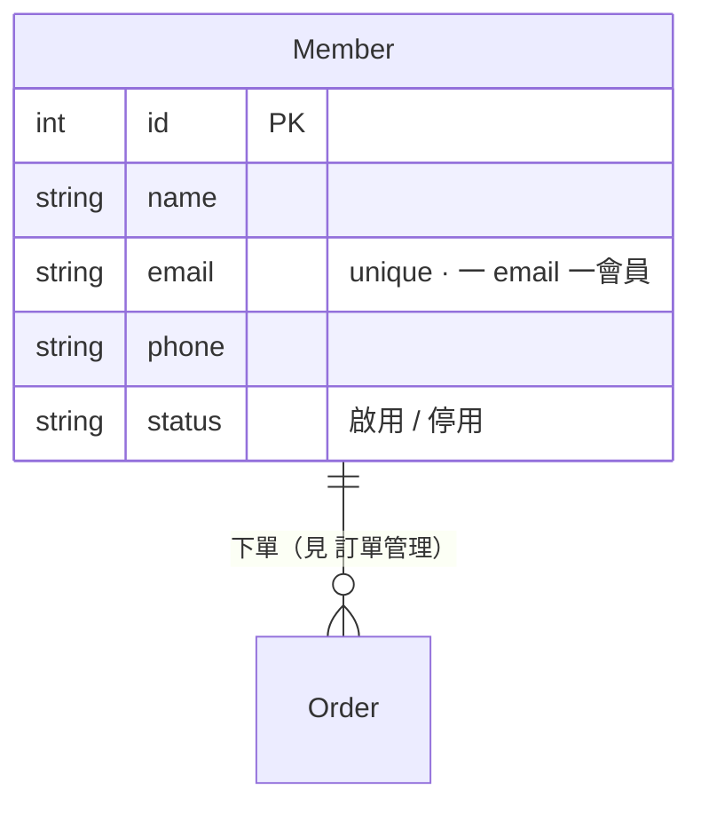

# INTENT: 會員管理

> 管平台的會員資料。本 repo 用它（和 [商品](商品管理.md)）講「**列表＋CRUD**」，外加最小的一種狀態：**獨立狀態（開關）**——啟用／停用，隨時可翻、沒有先後。（跟 [訂單](訂單管理.md) 的「生命週期狀態」對照著看。後端 app 名：`member`）

## 名詞（這個功能裡的「東西」）

- `會員 Member`：一個註冊的人（姓名、email、電話、狀態）。**訂單的「下單的人」就是它**（[訂單管理](訂單管理.md) FK 指向這裡，不另捏客戶表）。

> **資料模型圖**（純文字，可直接改）：



> model 設計原則（快照 / 衍生 / 業務識別碼 / 停用不刪）→ 見 [資料模型設計原則](資料模型設計原則.md)。

## 角色（Who）

- `管理員 Admin`：新增 / 查 / 改 / 停用會員。（sandbox 先不做會員自助，全由 admin 管）

## 狀態（獨立狀態／開關）

狀態：`啟用`、`停用`——這是**獨立狀態**：兩態、可逆、隨時翻、沒有守衛也沒有終點。想成一個電燈開關。

```
(無)  --(管理員: 新增)-------> 啟用   [email 未被用過]   {一 email 一會員}
啟用  --(管理員: 停用)-------> 停用                     {停用只是關閉，不刪資料}
停用  --(管理員: 重新啟用)---> 啟用
```

> **獨立狀態 vs 生命週期狀態**：這裡的啟用/停用只回答「現在能不能用？」（屬性，隨你翻）；而 [訂單](訂單管理.md) 的狀態回答「走到哪一步、下一步能去哪？」（歷程，有向、有守衛、有終態）。同一個字「狀態」，兩種物種——會員／商品是最小的那種。

## 權限 5W（每個 Action 一組）

| Action | Who | What（資源/欄位） | When（狀態/條件） | Where（範圍） | Why（理由） |
|--------|-----|------------------|------------------|--------------|------------|
| 新增 | 管理員 | 會員（全欄） | email 未重複 | 平台 | 建檔 |
| 改 | 管理員 | 會員（除 email） | 啟用/停用皆可 | 平台 | 維護資料 |
| 停用 | 管理員 | 會員.狀態 | 啟用時 | 平台 | 保留歷史、不硬刪 |
| 重新啟用 | 管理員 | 會員.狀態 | 停用時 | 平台 | 復用舊會員 |

## 鐵則（永遠成立，不可破）

- {一個 email 只能對到一個會員}
- {停用 = 關閉，資料保留（不是 DELETE）}

## 邊界 / 暫不處理（park）

- 會員自助註冊 / 登入（auth）——sandbox 進階層，park。
- 角色 / 權限細分——park。
- 軟刪除以外的資料保留策略——park。
