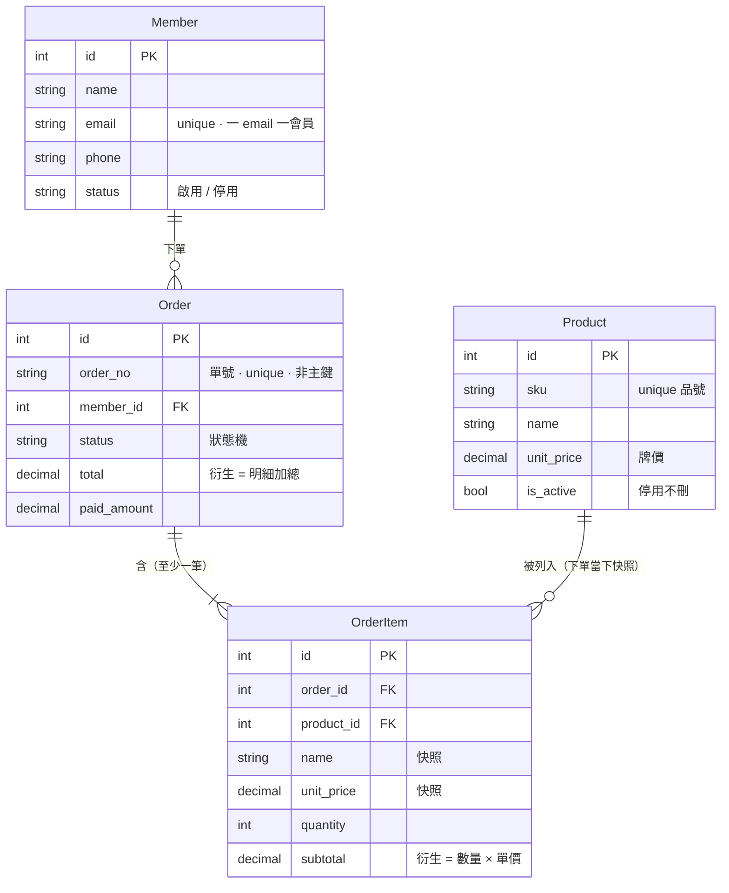

# INTENT: 訂單管理

> 管一張張銷售訂單。**分兩階段建 / 教：Stage A 無狀態（表層 CRUD）→ Stage B 有狀態（底層 承重牆）。同一個訂單，加深一次。**（後端 app 名建議：`order`）

## 名詞（這個功能裡的「東西」）

- `會員 Member`：下單的人。**就是 [會員管理](會員管理.md) 的 Member**（不另捏客戶表）——訂單 FK 指向它。
- `商品／服務 Product`：可販售的品項目錄（品號、品名、牌價、上下架）。**就是 [商品管理](商品管理.md) 的 Product**。**單一真相**：品名與價格只在這裡改。
- `訂單 Order`：一次銷售（單號、會員、日期、狀態、總額）。
- `訂單明細 OrderItem`：訂單裡的一個品項。**下單當下把 Product 的品名＋單價「抄一份」存下來（快照）**——之後目錄改價／改名／下架，歷史訂單不動。一張訂單有多筆 → **1:N**。

> **資料模型圖**（純文字，可直接改成你要的東西）：



> 為什麼這樣訂（快照 / 衍生 / 單號 / 停用不刪）→ 見 [資料模型設計原則](資料模型設計原則.md)。

## 角色（Who）

- `業務 Sales`：建單、改單、推進狀態。（財務 / 出貨分權 park，先單一角色）

---

## Stage A — 無狀態（表層 · 會指名 · 訂單管理 CRUD 列表頁）

只做 **CRUD ＋ 關聯**，不做生命週期。

### 狀態機

（此階段**刻意無狀態機**——訂單就是一筆「有明細、有會員」的資料。）

```
(無)   --(業務: 建單)--> (存在)   [至少一筆明細]   {總額 = 所有明細小計加總}
(存在) --(業務: 改單)--> (存在)                   {總額永遠 = 明細加總}
(存在) --(業務: 刪單)--> (無)
```

### 鐵則

- {訂單總額 = 所有明細小計加總}（改任何明細，總額自動重算）
- {明細小計 = 數量 × 單價}
- {一張訂單至少一筆明細}

> 教什麼：**資料模型（訂單–明細 1:N、訂單–會員 關聯、明細–商品 快照）＋ CRUD ＋ 第一個不變量（總額=加總）**。沒有狀態，但已經有鐵則。

---

## Stage B — 有狀態（底層 · 會判斷 · 訂單詳細頁）

在 Stage A 上**加生命週期 ＋ 更多鐵則**。

### 狀態機

狀態：`待付款`、`已付款`、`已出貨`、`已完成`、`已退款`

```
(無)   --(業務: 建單)--> 待付款   [至少一筆明細]      {總額 = 明細加總}
待付款 --(業務: 收款)--> 已付款   [收款金額 = 總額]
已付款 --(業務: 出貨)--> 已出貨
已出貨 --(業務: 完成)--> 已完成
已付款 --(業務: 退款)--> 已退款   [退款 ≤ 已付]       {退款金額 ≤ 已付金額}
已出貨 --(業務: 退款)--> 已退款   [退款 ≤ 已付]
```

### 鐵則（新增）

- {已出貨後不能再改明細 / 總額}
- {退款金額 ≤ 已付金額}
- {`已完成` / `已退款` = 終態，不可再轉}

> 教什麼：**狀態機、被禁止的轉移、生命週期不變量**。
> **這一份就是「三問找碴」的素材頁**——出題時故意埋錯讓學員抓：漏「退款」那條路、允許「已出貨改明細」、退款無上限、總額沒鎖成加總。

## 權限 5W（合併）

| Action | Who | What（資源/欄位） | When（狀態） | Where | Why |
|--------|-----|------------------|-------------|-------|-----|
| 建單 | 業務 | 訂單＋明細 | — | 平台 | 開一張銷售 |
| 改明細 | 業務 | 明細 | 待付款 / 已付款（未出貨） | 平台 | 出貨前可調整 |
| 收款 | 業務 | 訂單.狀態 | 待付款 | 平台 | 確認付款 |
| 出貨 | 業務 | 訂單.狀態 | 已付款 | 平台 | 出貨 |
| 完成 | 業務 | 訂單.狀態 | 已出貨 | 平台 | 結案 |
| 退款 | 業務 | 訂單.狀態＋金額 | 已付款 / 已出貨 | 平台 | 退錢給客戶 |

## 鐵則（永遠成立，不可破 · 總表）

- {訂單總額 = 所有明細小計加總}
- {明細小計 = 數量 × 單價}
- {明細品名／單價 = 下單當下的目錄快照（目錄事後變動不影響歷史訂單）}
- {每張訂單有唯一單號 order_no（業務識別碼，非 DB 主鍵）}
- {商品下架 = is_active=False（不 DELETE），歷史明細仍指得到}
- {退款金額 ≤ 已付金額}
- {已出貨後明細 / 總額不可改}
- {終態（已完成 / 已退款）不可再轉移}

## 邊界 / 暫不處理（park）

- 庫存扣減、金流串接、發票——深水，往「打造城堡 / 顧問」延伸，park。
- 多角色分權（財務 / 出貨）——park。
- 分步表單建單（wizard）——UIUX 按需，park。
- 部分退款 / 多次退款——park（先做全額單次退款）。
