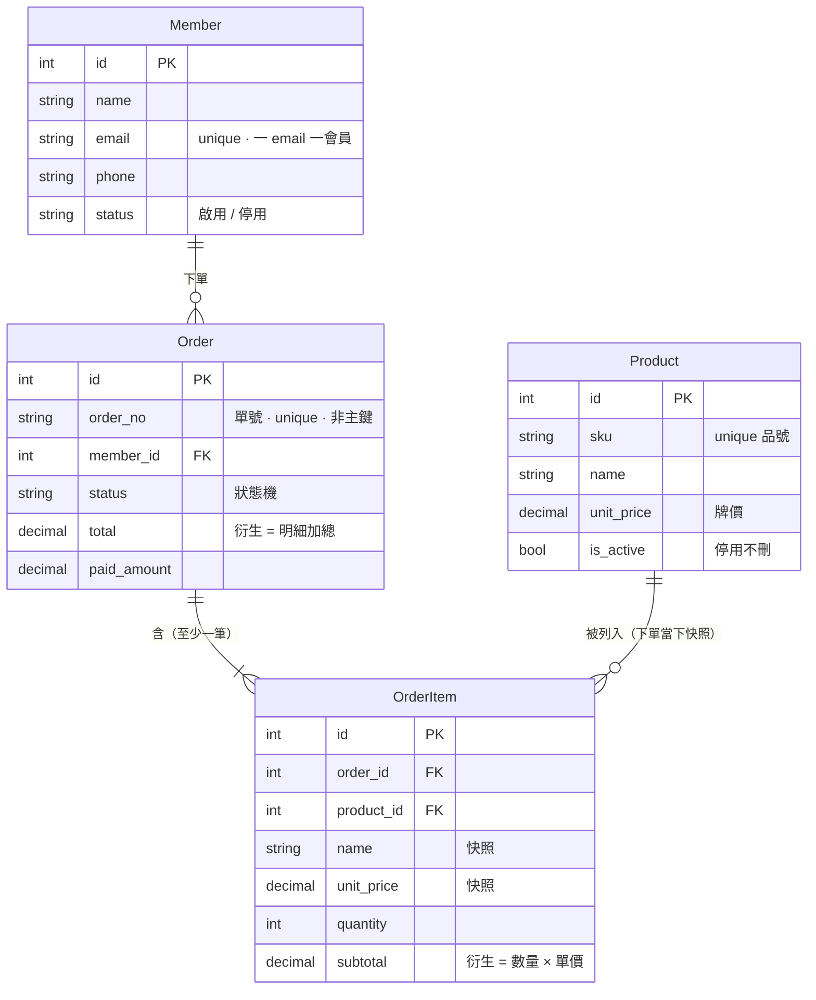

# INTENT: 訂單管理

> 管一張張銷售訂單。本 repo 用它講「**狀態與流程**」：把會員／商品兩張主檔**串起來** → 下單當下**抄快照** → 之後**跑生命週期狀態機**。（CRUD 的基本功交給 [會員](會員管理.md) / [商品](商品管理.md) 兩份講。後端 app 名：`order`）

## 名詞（這個功能裡的「東西」）

- `會員 Member`：下單的人。**就是 [會員管理](會員管理.md) 的 Member**（不另捏客戶表）——訂單 FK 指向它。
- `商品／服務 Product`：可販售的品項目錄（品號、品名、牌價、上下架）。**就是 [商品管理](商品管理.md) 的 Product**。**單一真相**：品名與價格只在這裡改。
- `訂單 Order`：一次銷售（單號、會員、日期、狀態、總額）。
- `訂單明細 OrderItem`：訂單裡的一個品項。**下單當下把 Product 的品名＋單價「抄一份」存下來（快照）**——之後目錄改價／改名／下架，歷史訂單不動。一張訂單有多筆 → **1:N**。

> **資料模型圖**（純文字，可直接改成你要的東西）：



> 為什麼這樣訂（快照 / 衍生 / 單號 / 停用不刪）→ 見 [資料模型設計原則](資料模型設計原則.md)。

## 角色（Who）

- `業務 Sales`：建單、改單、推進狀態。（財務 / 出貨分權 park，先單一角色）

---

## 生命週期狀態（狀態機 · 訂單的一生）

訂單 = 三拍疊起來：**串關聯**（把 [會員](會員管理.md) ＋ [商品](商品管理.md) 明細接上）→ **抄快照**（下單當下把品名／單價存進明細，見上）→ **跑狀態**（下面的生命週期）。前兩拍是設定，狀態機才是主戲。

> **生命週期狀態 vs 獨立狀態**：[會員](會員管理.md)/[商品](商品管理.md) 的啟用停用、上下架是**獨立狀態（開關）**——兩態、可逆、隨你翻。訂單這裡是**生命週期狀態**——多態、有向（多半不可退）、有守衛（哪步能走哪步有規定）、有終態。同一個字「狀態」的兩端，訂單是完整的那端。

狀態：`待付款`、`待出貨`、`已出貨`、`已取消`

```
(無)   --(業務: 建單)--> 待付款   [至少一筆明細]      {總額 = 明細加總}
待付款 --(業務: 收款)--> 待出貨   [收款金額 = 總額]
待出貨 --(業務: 出貨)--> 已出貨   （終態·成功）
待付款 --(業務: 取消)--> 已取消   （終態）
待出貨 --(業務: 取消)--> 已取消   （終態）
```

### 鐵則（生命週期相關；不變量總表見文末）

- {已出貨後不能再改明細 / 總額}
- {已出貨後不可取消（出貨前才可取消）}
- {`已出貨` / `已取消` = 終態，不可再轉}

> 教什麼：**串關聯 → 抄快照 → 狀態機／被禁止的轉移／生命週期不變量**。CRUD 基本功在 [會員](會員管理.md) / [商品](商品管理.md) 講，訂單專攻「狀態與流程」。
> **這一份就是「三問找碴」的素材頁**——出題時故意埋錯讓學員抓：允許「已出貨還能取消」、允許「已出貨改明細」、跳步（待付款直接出貨）、總額沒鎖成加總。

## 權限 5W（合併）

| Action | Who | What（資源/欄位） | When（狀態） | Where | Why |
|--------|-----|------------------|-------------|-------|-----|
| 建單 | 業務 | 訂單＋明細 | — | 平台 | 開一張銷售 |
| 改明細 | 業務 | 明細 | 待付款 / 待出貨（未出貨） | 平台 | 出貨前可調整 |
| 收款 | 業務 | 訂單.狀態 | 待付款 | 平台 | 確認付款 |
| 出貨 | 業務 | 訂單.狀態 | 待出貨 | 平台 | 出貨結案 |
| 取消 | 業務 | 訂單.狀態 | 待付款 / 待出貨 | 平台 | 出貨前作廢 |

## 鐵則（永遠成立，不可破 · 總表）

- {訂單總額 = 所有明細小計加總}
- {明細小計 = 數量 × 單價}
- {明細品名／單價 = 下單當下的目錄快照（目錄事後變動不影響歷史訂單）}
- {每張訂單有唯一單號 order_no（業務識別碼，非 DB 主鍵）}
- {商品下架 = is_active=False（不 DELETE），歷史明細仍指得到}
- {已出貨後明細 / 總額不可改}
- {已出貨後不可取消（出貨前才可取消）}
- {終態（已出貨 / 已取消）不可再轉移}

## 邊界 / 暫不處理（park）

- 庫存扣減、金流串接、發票——深水，往「打造城堡 / 顧問」延伸，park。
- **退款金流**（取消已收款的訂單、錢怎麼退回去）——狀態只作廢，退錢是金流，park。
- 「已完成 / 結案」這個獨立狀態——先把「已出貨」當成功終態，park。
- 多角色分權（財務 / 出貨）、分步表單建單（wizard）——park。
