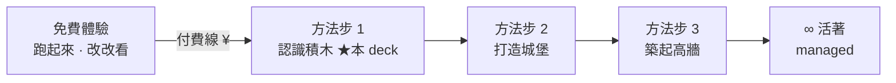

# 教學投影片 · 腳本（storyboard）

這裡是**「認識積木」這一步投影片的腳本**（逐頁要長怎樣，先寫這、再做投影片）。
放在 lean-stack 是因為 **sandbox 就是它的教材**（截圖、真的會動的頁面都在這）。

## 對齊哪份規劃（正本在 ai-yorozuya，不要在這另立一套）

- **課程結構正本**：`ai-yorozuya/docs/5-課程/素材/00_課程目錄.md`
- **本章正本**：`ai-yorozuya/docs/5-課程/素材/認識積木_v0.md`（第 3 步、付費起點；就是「兩頁學會前後端」）
- **詞彙正本**：`ai-yorozuya/docs/1-資產/積木詞彙對照_v0.md`——**元件/詞彙都從這取，別自己造**（law-schema ↔ 積木詞彙的唯一橋）

> 這份 = 上面三份的「投影片化」。內容、詞彙、順序以正本為準；這裡只負責排成一頁頁 ＋ 綁 sandbox 截圖。

## 課程總地圖（一體驗 ＋ 三方法步）



- 營建比喻：**積木 → 城堡 → 高牆**。
- 本 deck 只做 **認識積木**，分兩層同物加深：**表層 ＝ 會員/商品**（列表頁 · 學「指名」 · 上半）→ **底層 ＝ 訂單**（詳細頁 · 學「判斷」 · 下半）。

## 檔案

| 檔案 | 是什麼 |
|------|--------|
| `投影片腳本.md` | 逐頁腳本（S00–S09；每頁：目標/畫面/標註/講稿/對應） |
| `screens/` | 截圖（在 live admin `:5174` 截，檔名對齊頁碼，如 `s03-list.png`） |

## 每頁的記錄格式（欄位固定）

```
### S## · 標題
- **目標**：學員看完這頁學到的「一句話」。
- **畫面**：哪個 admin 頁（路由）＋ 截圖檔名，或「純文字/圖」。
- **標註**：要在截圖上框起來的元件（①②③…）。沒有寫「—」。
- **講稿重點**：口說要點到的 2~4 條。
- **對應**：正本（認識積木_v0 / 積木詞彙對照）＋ sandbox 的頁面/intent。
```

## 圖與截圖規範

- **結構/流程/資料模型 → Mermaid**（GitHub 直接渲染、可改，跟 `intents/` 同套路）。
- **元件標註 → 截圖 + 框線**：在 live `:5174` 截（資料真、有說服力）；框線標號做投影片時再加，腳本只負責「框哪裡、標什麼」。截圖放 `screens/`，檔名對齊頁碼。
