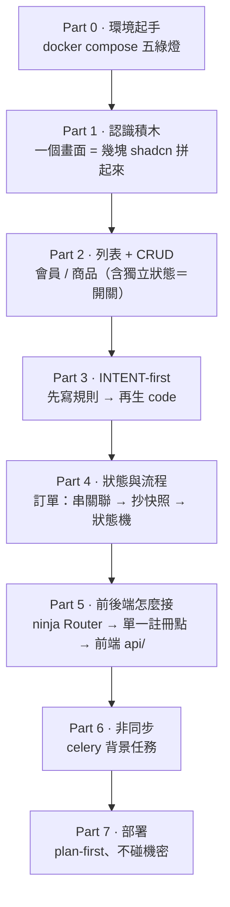

# 教學投影片 · 腳本（storyboard）

這裡是**投影片的單一真相**：每一頁 PPT 要長怎樣，先寫在這、再去做投影片。
跟 `code` / `intents` 一起版本控制——**畫面改了，腳本跟著改**，不靠口頭記憶漂來漂去。

## 檔案

| 檔案 | 是什麼 |
|------|--------|
| `投影片腳本.md` | 逐頁腳本（每頁：目標／畫面／標註／講稿／對應 code） |
| `screens/` | 截圖（在 live 的 admin `:5174` 截，檔名對應投影片編號，如 `s03-members.png`） |
| `diagrams/` | 自己畫的圖（Mermaid 匯出或 SVG）；純結構圖建議直接寫 Mermaid 在腳本裡 |

## 每頁的記錄格式（鐵則：欄位固定）

```
### S## · 標題
- **目標**：學員看完這頁學到的「一句話」。
- **畫面**：哪個 admin 頁（路由）＋ 截圖檔名（screens/…），或「純文字/圖、不截圖」。
- **標註**：要在截圖上框起來的積木（①②③…＋每塊標的元件名/責任）。沒有就寫「—」。
- **講稿重點**：口說時要點到的 2~4 條。
- **對應**：這頁背後的 intent / code 檔（讓「投影片 ↔ 真相」對得上）。
```

## 圖與截圖規範

- **結構／流程／資料模型 → Mermaid**（`flowchart` / `stateDiagram` / `erDiagram`）。GitHub 直接渲染、學員可改，跟 `intents/` 同一套路。
- **UI 積木標註 → 截圖 + 框線**。截圖在 live `:5174` 畫面截（資料是真的、最有說服力）；框線與標號在做投影片時加，腳本只負責**精確指定框哪裡、標什麼字**。
- 截圖檔名 = 投影片編號前綴（`s03-…`），放 `screens/`，方便對照。

## 課程總地圖（先定骨架，逐頁再長）



> 對照課程定位：**會員／商品講「列表＋CRUD＋獨立狀態」，訂單講「狀態與流程」**（見 `intents/`）。
