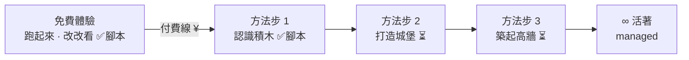

# 教學腳本（storyboard）

各章教學要長怎樣的**單一真相**：先寫這、再做投影片 / 帶課。放在 lean-stack 是因為 **sandbox 就是教材**（截圖、真的會動的頁面都在這）。

## 對齊哪份規劃（正本在 ai-yorozuya，不要在這另立一套）

- **課程結構正本**：`ai-yorozuya/docs/5-課程/素材/00_課程目錄.md`
- **各章正本**：`ai-yorozuya/docs/5-課程/素材/{免費體驗,認識積木,打造城堡,築起高牆}_v0.md`
- **詞彙正本**：`ai-yorozuya/docs/1-資產/積木詞彙對照_v0.md`——**元件/詞彙都從這取，別自己造**

> 這資料夾 = 上面那些的「腳本/投影片化」。內容、詞彙、順序以正本為準；這裡只負責排成一拍拍 ＋ 綁 sandbox 截圖。

## 課程總地圖（一體驗 ＋ 三方法步）

營建比喻：**積木 → 城堡 → 高牆**。付費線切在免費體驗尾端（純 vibe ↔ 學方法）。

## 檔案

| 檔案 | 章 | 是什麼 |
|------|----|--------|
| [`免費體驗.md`](免費體驗.md) | 免費層 · 第一步 | 「帶著做」的 live session 節拍。步驟正本＝`START.md`，內核＝**心理許可**（弄壞退得回） |
| [`認識積木.md`](認識積木.md) | 方法步 1 · 付費起點 | **兩頁學會前後端**的投影 deck（S00–S09）：表層=會員/商品（指名）→ 底層=訂單（判斷） |
| `screens/` | — | 截圖（live admin `:5174` 截）。認識積木用 `sNN-*`、免費體驗用 `free-NN-*` |

## 記錄格式與規範

- 每拍固定欄位：**目標 / 畫面 / 標註 / 講稿重點 / 對應**（對應＝正本 ＋ sandbox 頁面/intent）。
- **結構/流程/資料模型 → Mermaid**（GitHub 直接渲染、可改，跟 `intents/` 同套路）。
- **元件標註 → 截圖 + 框線**：在 live `:5174` 截（資料真、有說服力）；框線標號做投影片時加，腳本只寫「框哪裡、標什麼」。截圖放 `screens/`。
