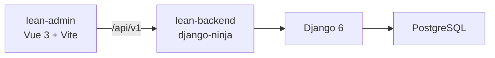
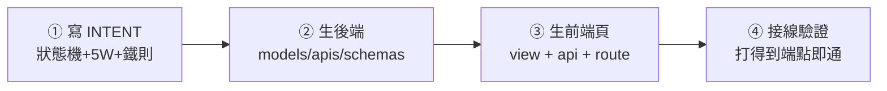
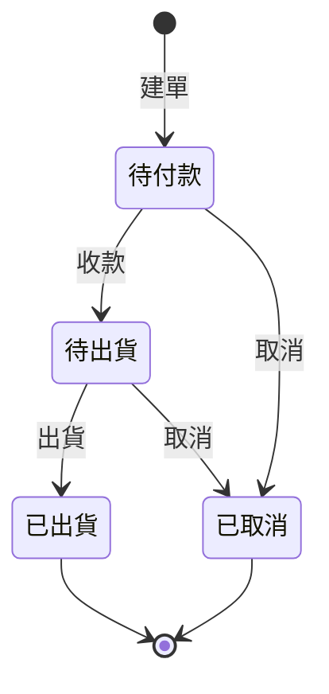

# 投影片腳本（逐頁）

格式見 [README](README.md)。每頁固定五欄：**目標 / 畫面 / 標註 / 講稿重點 / 對應**。
`screens/sNN-*.png` = 在 live admin（`:5174`）截的圖。

---

## Part 0 · 環境起手

### S00 · 封面
- **目標**：一句話讓人知道這堂在幹嘛。
- **畫面**：純標題頁。「lean-stack —— 從零看懂一個全端後台」＋紅熊 logo。
- **標註**：—
- **講稿重點**：這不是教你背語法，是帶你看「一個真實後台怎麼從規則長出來」。
- **對應**：`README.md`

### S01 · 這是什麼：兩個 app、一條端到端
- **目標**：先有全貌——前端打後端、後端連 DB，就這麼一條線。
- **畫面**：純圖（下方 Mermaid）。
- **標註**：—
- **講稿重點**：後台（lean-admin）＝人看的；後端（lean-backend）＝規則與資料的真相；一條 `/api/v1` 串起來。
- **對應**：`README.md`、`CLAUDE.md` 的「兩 app 佈局」



### S02 · 起手：一鍵起、五綠燈
- **目標**：不碰環境細節，一個指令把整套跑起來。
- **畫面**：截 Docker Desktop 五個容器綠燈（`screens/s02-compose.png`）。
- **標註**：框出 5 個服務：`postgres / redis / backend / worker / admin`，各標一句「這是什麼」。
- **講稿重點**：全走 docker、不跑本機 runserver；五綠燈＝活著；改 code 即時反映不用 rebuild。
- **對應**：`START.md`、`infra/docker-compose.local.yml`

---

## Part 1 · 認識積木

### S03 · 認識積木：一個畫面 = 幾塊 shadcn 拼起來 ★核心
- **目標**：學員「看穿」頁面——它不是一整塊，是有名字的積木拼起來，每塊一個責任。
- **畫面**：截「會員列表」（`/members`）整頁（`screens/s03-members.png`）。
- **標註**（在截圖上框線標號；就是你說的「把 input/select/pagination 框起來」）：

  | 框 | 積木 | 元件 | 責任（一句話） |
  |----|------|------|----------------|
  | ① | 搜尋框（input＋放大鏡鈕相連） | `@/components/ui/input` + `ui/button` | 打字找人 |
  | ② | 狀態下拉 | `@/components/ui/select` | 篩啟用／停用 |
  | ③ | 新增會員 | `@/components/ui/button` | 開建立表單 |
  | ④ | 資料表 | `@/components/DataTable.vue` | 讀清單（表頭/表身、捲軸對齊都包好） |
  | ⑤ | 啟用狀態開關 | `@/components/ui/switch` | 直接切停用／啟用 |
  | ⑥ | 操作·編輯 | `@/components/ui/button`（icon） | 改這一筆 |
  | ⑦ | 分頁 | `@/components/Pagination.vue` | 換頁 |

  截圖框線的版面參考（wireframe）：

  ```
  ┌─ 會員列表 ─────────────────────────────────────────────┐
  │ [① 搜尋框🔍] [② 狀態▾]                    [③ + 新增會員] │
  │ ┌────────────────────────────────────────────────────┐ │
  │ │ 姓名  email  電話  註冊日期  啟用狀態      操作      │ │  ← ④ DataTable
  │ │ …                              [⑤ ●切]   [⑥ ✎]     │ │
  │ └────────────────────────────────────────────────────┘ │
  │                     ‹ 1 2 ›  ← ⑦ Pagination            │
  └────────────────────────────────────────────────────────┘
  ```
- **講稿重點**：① 每塊積木都因為「一個動作」存在。② 積木一律用 `@/components/ui/*`（shadcn-vue，複製進 repo、你擁有可改）。③ 這套詞彙表下面每一頁都會重複用到。
- **對應**：`apps/lean-admin/src/views/MemberListView.vue`、`CLAUDE.md`「前端設計系統」

### S04 · 積木詞彙表（一頁速查）
- **目標**：把上一頁的積木收成一張可查的表。
- **畫面**：純表格（同 S03 的元件清單）＋ 各積木的縮圖。
- **標註**：—
- **講稿重點**：缺的積木用 `npx shadcn-vue add <name>` 補；清單頁的表格一律用 `DataTable.vue`，別再手刻 `<table>`。
- **對應**：`src/components/ui/`、`src/components/DataTable.vue`

---

## Part 2 · 列表 + CRUD（會員 / 商品）

### S05 · 讀清單：table + pagination
- **目標**：最基本的「看資料」。
- **畫面**：會員列表（`screens/s05-list.png`）。
- **標註**：框 DataTable 的「表頭固定 / 表身捲動 / 右緣對齊」與分頁。
- **講稿重點**：資料從後端 `GET /member` 來（`{ items, count }`）；分頁客戶端切。
- **對應**：`MemberListView.vue`、`src/api/member.js`

### S06 · 篩選：input + select + 搜尋
- **目標**：帶條件讀清單。
- **畫面**：會員列表工具列特寫（`screens/s06-filter.png`）。
- **標註**：框 ①搜尋框 ②狀態下拉，箭頭指向「送到後端 `q` / `status`」。
- **講稿重點**：搜尋按鈕／Enter 才送；每次搜尋回第一頁。
- **對應**：`MemberListView.vue` 的 `load()`

### S07 · 新增／編輯：button → dialog → form
- **目標**：建立與修改，走彈窗表單。
- **畫面**：新增會員 dialog（`screens/s07-dialog.png`）。
- **標註**：框 Dialog、Form 欄位、＋標「email 建立後不可改（識別碼）」。
- **講稿重點**：撞 email → 後端 422 → 前端顯示白話（鐵則 {一 email 一會員} 住在後端）。
- **對應**：`MemberListView.vue`、`intents/會員管理.md`

### S08 · 停用不刪：獨立狀態＝一個開關 ★概念
- **目標**：帶出「狀態」的最小型態——可逆的開關。
- **畫面**：會員/商品的狀態欄 Switch 特寫（`screens/s08-switch.png`）。
- **標註**：框 Switch，標「啟用⇄停用，隨時可翻、沒有終點」。
- **講稿重點**：**獨立狀態**（開關）：兩態、可逆、無守衛。停用不刪＝資料保留、歷史指得到。埋伏筆：訂單的狀態是另一種。
- **對應**：`intents/會員管理.md`、`intents/商品管理.md`、`ui/switch`

### S09 · 商品：同型再一次（+ 快照來源伏筆）
- **目標**：CRUD 熟練一次；順帶點出「商品會被訂單引用」。
- **畫面**：商品列表（`screens/s09-products.png`）。
- **標註**：框「牌價」欄，標「訂單下單時會抄這個當快照」。
- **講稿重點**：跟會員同一套積木；差別是商品是**被引用的目錄**、單一真相。
- **對應**：`ProductListView.vue`、`intents/商品管理.md`

---

## Part 3 · INTENT-first（先寫規則、再生 code）

### S10 · 順序：先 INTENT → 後端 → 前端 → 接線
- **目標**：講清楚本 repo 的核心做法。
- **畫面**：純圖（下方 Mermaid）。
- **標註**：—
- **講稿重點**：規則先於 code；狀態機／權限／鐵則先寫死，再照著生。
- **對應**：`CLAUDE.md`「INTENT-first 加功能」、`.claude/skills/add-feature`



### S11 · INTENT 長怎樣（拆一份給看）
- **目標**：看懂一份 INTENT 的四個段落。
- **畫面**：截 `intents/訂單管理.md`（狀態機 + 5W 表 + 鐵則）。
- **標註**：框「名詞(erDiagram) / 狀態機 / 權限 5W / 鐵則」四段。
- **講稿重點**：純文字、GitHub 直接渲染、學員可直接改。
- **對應**：`intents/訂單管理.md`、`intents/README.md`

### S12 · 資料模型設計原則
- **目標**：四條原則一次收。
- **畫面**：純文字條列。
- **標註**：—
- **講稿重點**：快照 / 衍生 / 業務識別碼 / 停用不刪。
- **對應**：`intents/資料模型設計原則.md`

---

## Part 4 · 狀態與流程（訂單）★重頭戲

### S13 · 訂單三拍：串關聯 → 抄快照 → 跑狀態機
- **目標**：訂單不是 CRUD，是三件事疊起來。
- **畫面**：純圖 + 訂單詳細頁截圖（`screens/s13-detail.png`）。
- **標註**：框詳細頁的「會員(關聯) / 明細(快照 name·price) / 狀態(生命週期)」。
- **講稿重點**：前兩拍是設定，狀態機才是主戲。
- **對應**：`intents/訂單管理.md`、`OrderDetailView.vue`

### S14 · 生命週期狀態機
- **目標**：看懂一張訂單的一生與合法轉移。
- **畫面**：純圖（Mermaid）。
- **標註**：—
- **講稿重點**：有向、有守衛、有終態——跟會員/商品的「開關」是兩個物種。



### S15 · 詳細頁：合法動作才長出來
- **目標**：UI 誠實反映狀態——只給能做的動作。
- **畫面**：訂單詳細頁三種狀態並排（待付款/待出貨/已出貨）（`screens/s15-actions.png`）。
- **標註**：框「收款 / 出貨 / 取消」按鈕，標「由後端 `available_actions` 決定長不長」。
- **講稿重點**：按鈕不是前端硬寫死，是後端說了算。
- **對應**：`OrderDetailView.vue`、`OrderSchema.available_actions`

### S16 · 被禁止的轉移＝承重牆（422）
- **目標**：示範「亂來會被擋」。
- **畫面**：截一個非法操作的 422 訊息（`screens/s16-422.png`）。
- **標註**：框錯誤訊息，標「守門在後端 `apply_transition()`，前端只顯示」。
- **講稿重點**：已出貨不能改/不能取消、不能跳步——這些鐵則砌在 model。
- **對應**：`apps/order/models.py` 的 `TRANSITIONS` / `apply_transition`

### S17 · 獨立狀態 vs 生命週期狀態（收束）
- **目標**：把 Part 2 的伏筆收成一條光譜。
- **畫面**：純圖（對照表）。
- **標註**：—
- **講稿重點**：會員/商品＝開關（最小端）；訂單＝狀態機（完整端）。同一個字「狀態」的兩端。
- **對應**：三份 intents 的「獨立狀態 vs 生命週期狀態」框

---

## Part 5 · 前後端怎麼接

### S18 · 一條端到端
- **目標**：看資料怎麼從按鈕跑到 DB 再回來。
- **畫面**：純圖（前端 api/ → ninja Router → model → PG）。
- **講稿重點**：前端不算錢——小計/總額都是後端算好回來的。
- **對應**：`src/api/order.js`、`apps/order/apis.py`

### S19 · 單一註冊點
- **目標**：新增端點不用改 urls。
- **畫面**：截 `core/api.py` 的 `add_router`。
- **講稿重點**：每 app 一個 Router，全掛在 `/api/v1/`。
- **對應**：`core/api.py`

---

## Part 6 · 非同步

### S20 · celery 背景任務
- **目標**：慢工作丟給 worker，前端輪詢進度。
- **畫面**：背景任務頁（`screens/s20-jobs.png`）。
- **標註**：框「RUNNING 進度條」與「輪詢」。
- **講稿重點**：local 與 prod 同構、刻意不開 eager（藏不了 async bug）。
- **對應**：`apps/progress`、`BackgroundTaskView.vue`

---

## Part 7 · 部署

### S21 · plan-first 上雲
- **目標**：部署的紀律，不是按鈕。
- **畫面**：純文字流程。
- **講稿重點**：AI 不自動 apply；plan 先、人 review 後人手 apply；永不 commit 機密/state。
- **對應**：`DEPLOY.md`、`.claude/skills/deploy`

---

> 待辦：Part 5–7 先列骨架，等前面幾 part 定稿再逐頁長細節。截圖清單見各頁「畫面」欄的 `screens/sNN-*.png`。
